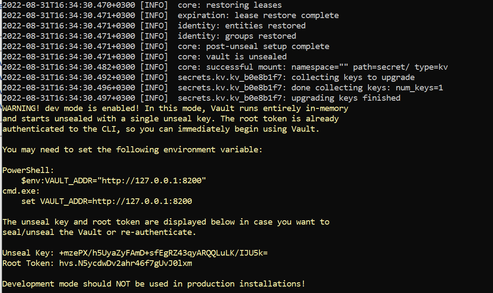
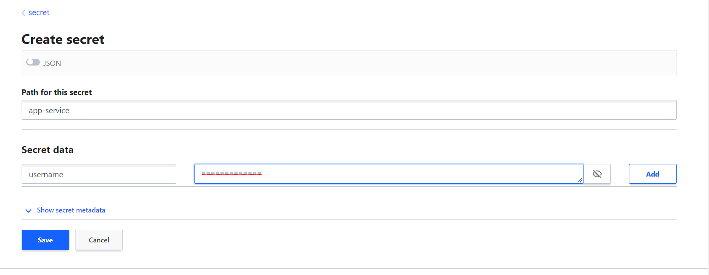
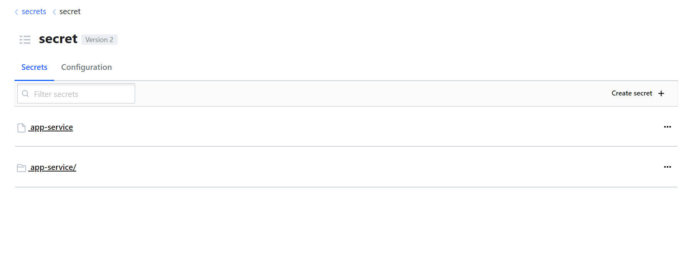
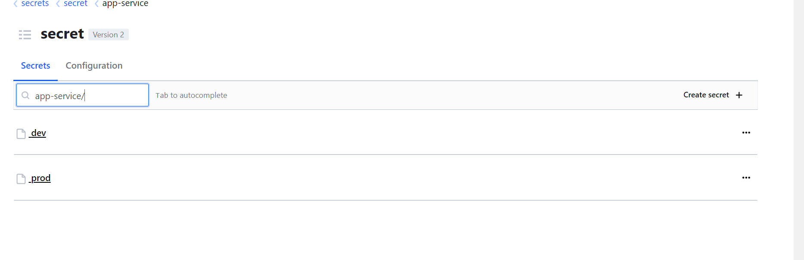

## SpringBoot-Vault Example

### Vault Installation:
- Windows : Download zip and extra anywhere and set the path in the environmental variable
- Start server:
        vault server --dev
- You need to set vault address in the environmental variable

- Go to browser : localhost:8200
- Copy the root token from the command line and paste into the browser token input field.
- Create secret using the name 'app-service' and set key : 'username' and 'value' : 'hello_world_local' 

- For creating profile for app-service, write app-service/dev , app-service/prod etc

- Now make spring profile in the spring boot application and make active profile from the bootstrap.properties

- Run the application to see the output in the console based on the profile you set in the bootstrap properties

### Important
- I face issue to see the UI of the vault in the windows machine. I make a below text file and save it as a .reg file and import into the Windows registry.

Windows Registry Editor Version 5.00

[HKEY_CLASSES_ROOT\.css]
"Content Type"="text/css"

[HKEY_LOCAL_MACHINE\SOFTWARE\Classes\.css]
"Content Type"="text/css"

[HKEY_CLASSES_ROOT\.js]
"Content Type"="application/javascript"

[HKEY_LOCAL_MACHINE\SOFTWARE\Classes\.js]
"Content Type"="application/javascript"